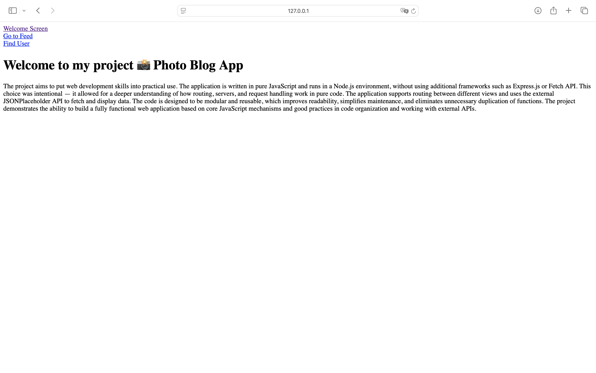
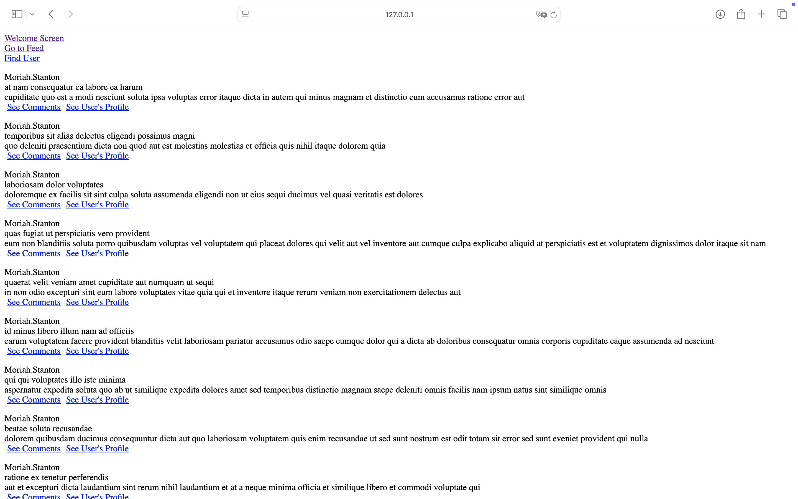
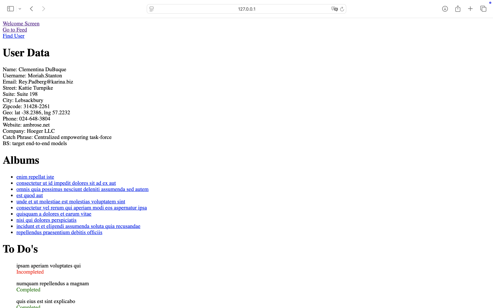

# 📸 Photo Blog App

### Project Objective

The goal of this project was to consolidate my JavaScript programming skills by working entirely with pure JavaScript, without using any external libraries. As part of the task, I developed a simple website built with HTML and JavaScript that allows users to browse posts and view user profiles. The data used in the application is retrieved from the JSON Placeholder service.

The page dynamically adjusts its content to reflect the current state of the application — during data fetching, a loading message is displayed, which is later replaced by the actual content once the operation is completed.

The project covers a broad range of JavaScript programming concepts, including asynchronous handling with async/await and Promise, DOM manipulation, and the use of XMLHttpRequest.

### Running the Project

To run the project locally, I recommend using the **Live Server** extension in Visual Studio Code. This is the same environment in which the project was built and tested, ensuring proper application behavior and correct rendering of all interface elements.

Once the local server is running, simply open the page in your browser to fully test its functionality.

### Project Contents

The application is an interactive service that displays user data and activity fetched from JSON Placeholder. The project demonstrates practical usage of asynchronous data fetching, dynamic DOM manipulation, and event handling in pure JavaScript.

The available features include:

- **Browsing user posts** – view all posts along with their content.
- **Reading comments** – expand any post to see related comments.
- **User profile view** – detailed author information such as contact details and location.
- **User search** – built-in search allows quick lookup of specific users by name.
- **Photo gallery** – a section displaying photos grouped by albums, allowing intuitive browsing.

The project was designed with simplicity, code readability, and practical application of key JavaScript concepts in mind — such as async/await, Promise, XMLHttpRequest, and dynamic DOM management.

